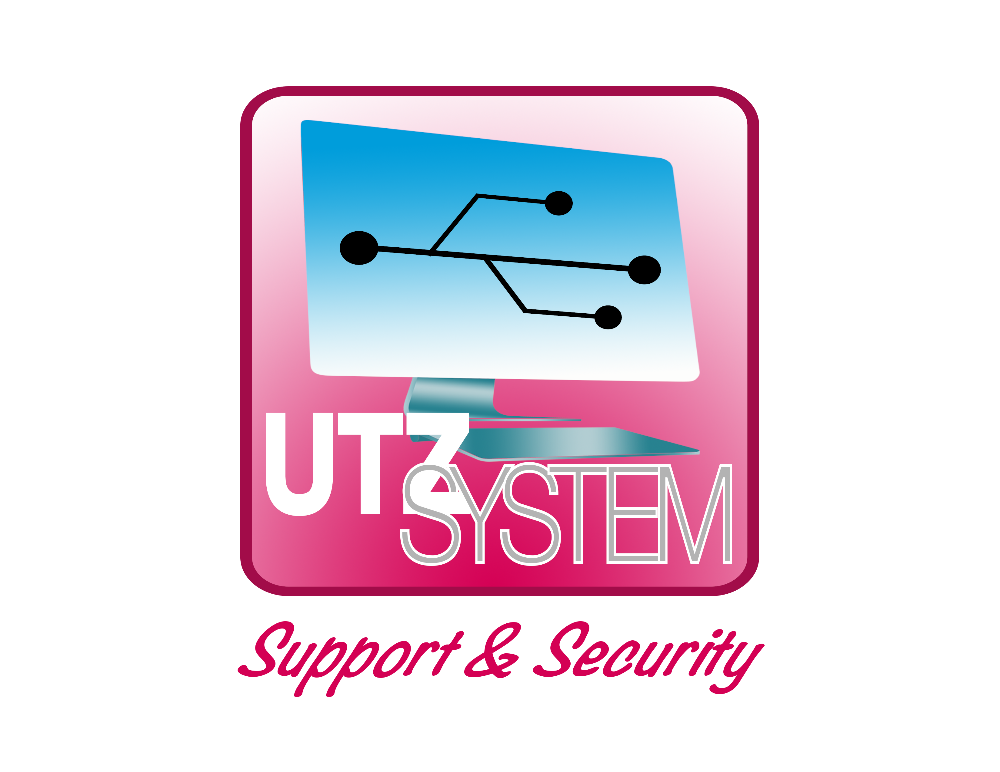

  <h1>Utz System</h1>

  <h4>Componentes de interfaz en HTML5 y CSS3</h4>

  

  

En Utz System trabajaremos un proyecto de componentes hechos en HTML5 y CSS3; (Programaremos para humano y no para computadoras) será desarrollador con código entendible para humanos, para su fácil comprensión y mejor viabilidad al reutilizar el código.
  

Visita Nuestro sitio WEB

- [Utz System](https://utzsystem.com/)

Si tienes dudas al implementar los componentes o si quiere contribuir y no sabes como, escríbenos en Twitter o Facebook

- [Utz System](https://twitter.com/utz_system)
- [Utz System](https://www.facebook.com/Utz-System-469198726471076/?ref=page_internal&mt_nav=0)
